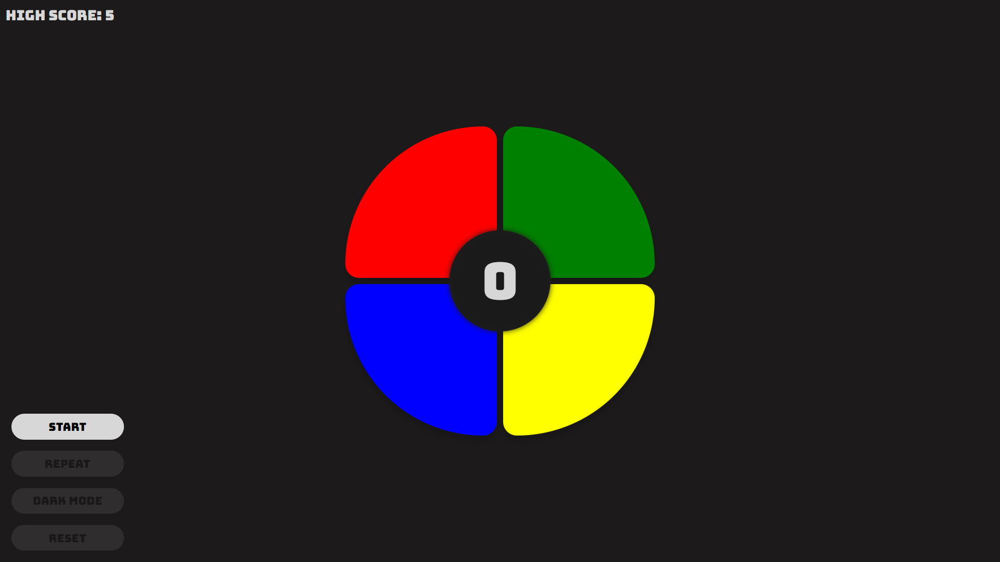

# Simon Says Game 🔴🟢🔵🟡

Hey there! Welcome to my Simon Says game. I built this as a JavaScript, HTML, and CSS implementation of the classic memory game. It's a practice project I created to explore vanilla web technologies and improve my coding skills.

## A Note on This Project

I want to be upfront: I'm fully aware that using React and Redux would be a much better choice for building this game in a production environment. However, I intentionally chose to use vanilla JavaScript, HTML, and CSS as a learning exercise. My goal was to understand these core technologies without the abstraction of modern frameworks. It's been a great journey in understanding the fundamentals!

## Setup

Want to run this locally? It's easy:
1. Clone this repo or download the source files.
2. Open `index.html` in your favorite modern web browser.
3. That's it! No npm install, no build process. Old school 🤓?

Or simply go to [babelyaga.github.io/simon](https://babelyaga.github.io/simon) and start playing.

## How to Play

1. Hit that "Start" button to kick things off.
2. Watch and listen to the sequence I'll show you.
3. Repeat it back by clicking the colored buttons in the same order.
4. Get it right, and I'll add another step to the sequence. How far can you go?
5. Make a mistake, and it's game over! But don't worry, you can always try again.

## Game Features

Here's what I've packed into this little game:

- Classic Simon Says gameplay with four colored buttons
- Progressive difficulty: The sequence speeds up as you advance
- Current level display so you can track your progress
- High score tracking using local storage
- A "Repeat" button to replay the current sequence (but use it wisely, only once per game!)
- "Reset" button when you want to start fresh
- "Dark Mode" toggle for a different visual experience (I thought it looked cool + it makes it a tad more difficult)
- Responsive design - try it on your phone!
- Sound effects for button presses (mute your device if you're playing at work!)
- Game over overlay to show off your final score

## Game Controls

- **Start**: Kicks off a new game
- **Repeat**: Forgot the sequence? Use this to see it again (once per game, choose wisely!)
- **Dark Mode**: Switches between color and grayscale. I added this for fun!
- **Reset**: Starts a new game whenever you want

## Technical Stuff (for the curious)

- I built this with vanilla JavaScript, HTML5, and CSS3
- DOM Manipulation: I used JavaScript to dynamically update the game state, change button colors, and display messages, all without any library assistance.
- Event Handling: Implemented custom event listeners for user interactions like button clicks and game state changes.
- State Management: Created a custom state management system using JavaScript objects to keep track of the game's current state, sequence, and player progress.
- Created a simple game loop to manage the flow of the game and handle transitions between states.
- Used CSS Grid for the button layout (it's responsive!)
- Added some CSS animations for button feedback
- Implemented the Web Audio API for those cool sound effects
- Your high score is saved in your browser's local storage

## What I Learned

Building this game with vanilla technologies taught me a lot about:
- DOM manipulation without the help of frameworks
- Managing state in plain JavaScript (it's trickier than it looks!)
- Handling events and creating a game loop
- Making responsive designs with CSS Grid and media queries
- Using browser APIs like Web Audio and Local Storage

## What's Next?

I've got some ideas for future updates:
- Code cleanup
- Refactoring to use React and Redux (I know, I know, I should have done this from the start)
- Adding more difficulty modes
- Creating more visual themes
- Maybe a multiplayer mode?
- Hooking it up to a backend for global high scores

## Easter Egg
There is a reason why the app's name is "Simon Said" and not "Simon Says".

I've hidden a little surprise in the game that triggers after a period of inactivity. See if you can find it!

Thanks for checking out my project. I had a blast making it and I hope you enjoy playing! Feel free to reach out if you have any questions or suggestions. Now what did Simon say exactly?
